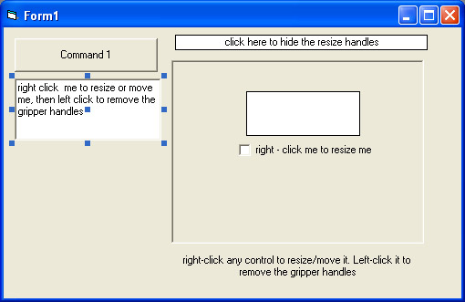



## allow users to resize any control , with resize handles, at runtime\! NO API

### Description

After searching forever for a good way to allow users to resize or move controls around on the form at runtime, I decided that I should just make my own method. The other ones I found here use the API method, which does not work well.

I have updated this to include the suggestions based on the feedback. While the "trails" are still there, they are much better, and the code is alot cleaner &amp; smaller now.
 
### More Info
 
read the comments in the module for how to use this , it's extremely simple.

             |
---                |---
**Submitted On**   |2005-11-09 15:00:40
**By**             |[Chris P\.](https://github.com/Planet-Source-Code/PSCIndex/blob/master/ByAuthor/chris-p.md)
**Level**          |Beginner
**User Rating**    |4.8 (24 globes from 5 users)
**Compatibility**  |VB 6\.0
**Category**       |[Custom Controls/ Forms/  Menus](https://github.com/Planet-Source-Code/PSCIndex/blob/master/ByCategory/custom-controls-forms-menus__1-4.md)
**World**          |[Visual Basic](https://github.com/Planet-Source-Code/PSCIndex/blob/master/ByWorld/visual-basic.md)
**Archive File**   |[allow\_user1947301192005\.zip](https://github.com/Planet-Source-Code/chris-p-allow-users-to-resize-any-control-with-resize-handles-at-runtime-no-api__1-63209/archive/master.zip)

### API Declarations

NONE!

